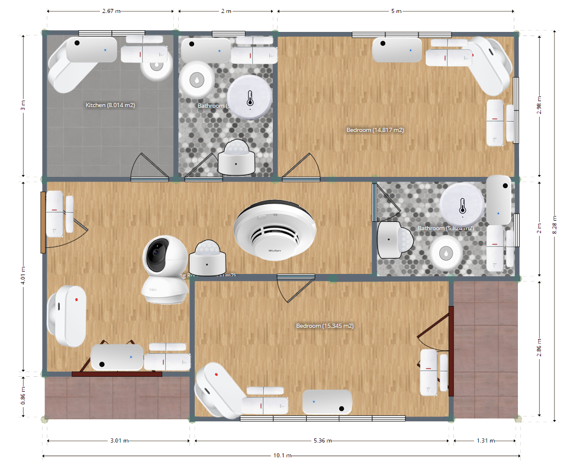

¿Alguna vez has sentido que tu casa es más inteligente que tú, pero a costa de que Google o Amazon sepan hasta cuándo vas al baño? En este artículo analizamos cómo montar una plataforma domótica profesional utilizando servidores locales para cuidar de nuestra privacidad, basándonos en un sistema robusto, privado y, sobre todo, diseñado para funcionar sin depender de un cable conectado a Silicon Valley.

# La Domótica: Más allá de encender bombillas con la voz

Cuando hablamos de domótica, la mayoría de la gente piensa en pedirle a un altavoz que ponga música, pero este proyecto nos recuerda que el verdadero potencial reside en la asistencia y la autonomía, especialmente para sectores vulnerables como las personas mayores. Lo verdaderamente interesante del enfoque de este trabajo es la arquitectura: en lugar de comprar dispositivos que se conectan "a la nube" (que es solo el ordenador de otra persona), se propone un sistema de control local centralizado.

Esto significa que el cerebro de tu casa vive en tu salón, no en un servidor remoto. Para lograrlo, el proyecto utiliza Home Assistant, una plataforma de código abierto que es básicamente el "anillo único" para gobernarlos a todos los dispositivos, sin importar la marca.

# El Corazón del Sistema: Servidores Privados y Virtualización

Aquí es donde nos ponemos técnicos pero de forma elegante. El proyecto no se conforma con una Raspberry Pi (que se queda corta cuando le pides mucho), sino que apuesta por un Mini PC actuando como coordinador central. Lo más brillante es el uso de Proxmox, un hipervisor que permite tener varias "máquinas virtuales" corriendo dentro del mismo aparato.

En este servidor privado conviven varios servicios críticos:

- **Home Assistant**: Gestiona la lógica y las automatizaciones.

- **Zigbee2MQTT**: Un traductor que permite que sensores de diferentes marcas hablen el mismo idioma sin usar WiFi (evitando saturar el router y mejorando la seguridad).

- **Frigate y Double Take**: Aquí entra la Inteligencia Artificial local. El sistema detecta personas y reconoce rostros en tiempo real usando un acelerador Google Coral TPU, procesando las imágenes dentro de casa para que ningún vídeo privado salga a internet.

# Sensores y Actuadores: Los ojos y manos de la casa

Para que una casa cuide de alguien, necesita sentir. El despliegue propuesto incluye desde los típicos sensores de movimiento hasta otros más específicos como sensores de flujo de agua (para detectar si alguien se ha dejado un grifo abierto demasiado tiempo) o detectores de inundación y humo.

Lo mejor es que la interacción no es solo a través de una pantalla. El proyecto subraya la importancia de los botones físicos multifunción y los avisos visuales/sonoros adaptados. Si el sistema detecta humo o una fuga, las luces de la casa pueden cambiar a color rojo o emitir un mensaje de voz personalizado por los altavoces, haciendo que la tecnología sea invisible pero omnipresente cuando se necesita.

# Privacidad y Seguridad: El "Modo Paranoico" bien aplicado

Como este blog trata de ciberseguridad, no podíamos pasar por alto que este diseño es una fortaleza digital. Al usar protocolos como Zigbee y procesar la IA localmente, reducimos drásticamente la "superficie de ataque". Además, para cuando necesitamos entrar desde fuera de casa, se propone un Proxy Inverso con Nginx y Cloudflare, asegurando que la conexión sea encriptada y segura, sin abrir agujeros peligrosos en nuestro router.

# Conclusión: ¿Merece la pena el esfuerzo?

Después de analizar este proyecto, la valoración es clara: la domótica "hazlo tú mismo" basada en servidores privados ha dejado de ser un hobby para entusiastas y se ha convertido en una alternativa real y profesional. Aunque la inversión inicial en configuración es mayor que comprar un kit barato en un supermercado, los beneficios en términos de soberanía de datos, fiabilidad (la casa funciona aunque se corte el internet) y personalización son imbatibles. Es un ejemplo perfecto de cómo la informática de alto nivel puede bajar a la tierra para solucionar problemas sociales y ayudar en gran medida a la calidad de vida de las personas.
