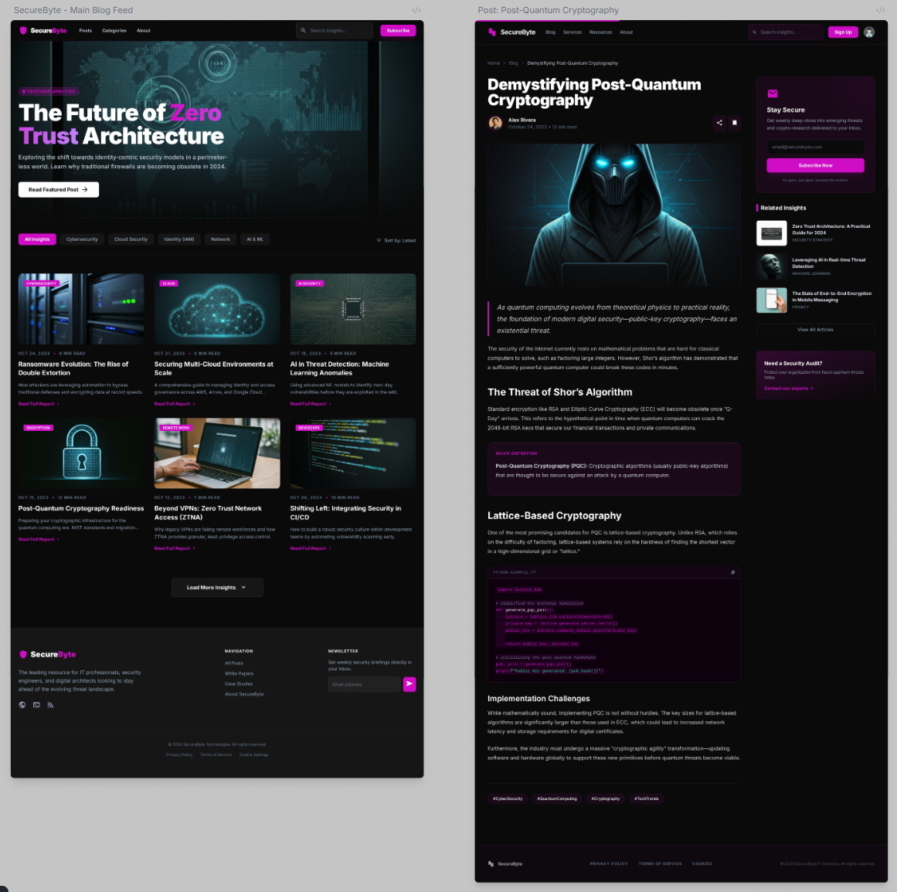

# El Auge de la Inteligencia Artificial

El auge de la Inteligencia Artificial (IA) es innegable, como se observa en este artículo de [Puromarketing](https://www.puromarketing.com/14/216598/auge-inteligencia-artificial-dejado-ventaja-competitiva-para-transformarse-expectativa-base):

```Text
Aproximadamente el 78% de las empresas han integrado IA en al menos un área de su negocio
```

Esto nos hace ver que la inteligencia artificial ha causado un viraje completo en cuanto a cómo se realizan las tareas del día a día, afectando a todas las áreas. Hoy en día la IA se ve involucrada en tareas complejas como la programación, las finanzas, resúmenes de correo electrónico, etc. Pero también se aplica a tareas sencillas. Cada vez es más común el tener una duda y, en lugar de hacer una búsqueda con un motor de búsqueda como Google, directamente lanzar la pregunta a cualquier IA que tengamos a mano.

# La Inteligencia Artificial en la Programación

Como he comentado en el párrafo anterior, hoy en día uno de los usos más extendidos de la IA es su uso en la programación. Este concepto no es nuevo, la IA lleva siendo el asistente de un alto porcentaje de programadores desde que la primera versión de ChatGPT salió en el 2024, hace ya dos años. Pero, al igual que los algoritmos que usan estos LLM (_Large Language Model_) han evolucionado, la forma en la que los programadores lo usamos también ha evolucionado. La metodología comenzó copiando código a ChatGPT para que identificase y solucionase errores. Tras esto se comenzó a pedir código directamente a la IA. Más tarde comenzaron a surgir extensiones las cuales generaban el código con el contexto de lo que el programador iba escribiendo y daba sugerencias. Y, tras muchas iteraciones, llegamos a donde nos encontramos hoy en día: inteligencias artificiales que hacen mucho más que escribir código o dar sugerencias.

# Los IDE también tienen IA

Un IDE es un programa usado para crear código de manera más sencilla y con herramientas que asisten en gran medida al crear programas. Algunos ejemplos de IDE pueden ser Visual Studio Code, PyCharm, IntelliJ IDEA, etc.

Pero, desde principios de 2025, un IDE que incorporaba la inteligencia artificial en el flujo de trabajo habitual comenzó a ganar popularidad. Este IDE se llama [Cursor](https://cursor.com/). Esto revolucionó por completo la forma en la que el mundo utilizaba la inteligencia artificial a la hora de programar. Con este programa, la IA pasó de ser un ayudante al programador a convertirse en un programador al completo. Y, gracias a este programa, el concepto de *Vive coder*salió a la luz. Un Vive Coder se le denomina a cualquier persona (con conocimientos de programación o no) que utiliza la IA para programar el 100% de los proyectos que crea. Desde entonces, crear cualquier proyecto no se convertía en cuestión de poseer los conocimientos necesarios para programar las funcionalidades requeridas, sino que era posible crear aplicaciones completas sin tocar una sola línea de código.

# Mi experiencia con los IDE con IA

El uso de Cursor para realizar todo tipo de tareas de programación fue una tendencia que fue muy bien acogida por muchos programadores. MiduDev fue uno de los primeros creadores de contenido de habla hispana dentro de este sector de la informática en sumarse al carro de Cursor.


Esta idea era completamente contraria a lo que yo entendía por programar. A su vez, tanto en la carrera como en el máster, hice uso de inteligencias artificiales como ChatGPT o Github Copilot para crear distintos programas y páginas web. Pero este uso que hice de las IAs fue simplemente como ayudantes o a través de sugerencias que muchas veces no tenían nada que ver con lo que yo pretendía programar. Por ese motivo nunca he confiado en ninguna IA para que realizase ningún trabajo por mí. Hasta que conocí y probé Antigravity para crear este blog.

# La creación del blog

Este blog será el reflejo de mi carrera profesional, y qué mejor forma que construirlo que experimentando con tecnologías nuevas. Por eso, para la creación de esta web se ha hecho uso de varios servicios de inteligencia artificial que han conseguido trabajar entre sí para crear lo que están viendo ahora mismo.

## Paso 1: El diseño

Poseo un avanzado pasado como desarrollador web tanto en el mundo laboral como en proyectos personales. En este pasado también he aplicado muchos conceptos de diseño y he ayudado a promover un desarrollo teniendo en cuenta la interfaz de usuario y la experiencia de usuario (UI/UX). Por lo que el diseño lo considero una de las etapas más importantes a la hora de crear una aplicación web desde cero.

Para el diseño quise probar algo nuevo y darle la potestad a un agente de inteligencia artificial. En este caso el servicio utilizado fue Stitch, perteneciente a Google. Con este servicio es posible crear tanto aplicaciones de escritorio o móvil como aplicaciones web mediante prompts y revisiones. En este caso las revisiones no fueron necesarias ya que, con el primer prompt, generó una interfaz exactamente como se la pedí:

```Text
i want a blog webapp dedicated to IT and security posts that looks very minimalistic
but modern, in a dark theme with this color as accent: #ce0fc7. Create a color pallete
from that accent that is compatible with angular 21 styling themes. This webapp should
have a main page that contains all of the posts and then each post should have its own
paragraphs, headings and images.
```



Una vez tenemos este diseño es posible comenzar con la implementación de la web.

## Paso 2: La creación de la web

Con el diseño preparado existen dos opciones para usarlo en Antigravity:

Exportar las ventanas que ha creado
Instalar el servidor MCP de Stitch en Antigravity y que se comuniquen directamente entre ellos.
En mi caso escogí la segunda opción. La escogí principalmente para tener la oportunidad de trabajar con servidores MCP. Estos servidores generan una especie de API (Application Programming Interface) que permite a dos servicios comunicarse entre ellos para realizar tareas simples, como por ejemplo obtener los diseños ya exportados y en un lenguaje que Antigravity entienda. Pero antes de comenzar a pedirle que programe nada también es necesario instalar las habilidades (skills) necesarias. Estas habilidades las proporciona el repositorio de Github: (link a repositorio). Donde, directamente se le puede pedir a Antigravity que instale estas skills para que puedan ser usadas en el proyecto.

Una vez que tenemos el servidor MCP y las habilidades bien configuradas podemos pedirle que, a partir del diseño de Stitch, nos cree una página web. En este caso, yo elegí que la web la crease utilizando el framework de Angular 21 debido a que tengo amplia experiencia con este marco de trabajo. Pero es posible pedirle cualquier otro framework o en html básico.

El primer problema que me encontré fue a la hora de visualizar la página. Esta se veía con el contenido correcto pero el estilo y los colores no tenían nada de parecido con el diseño de antigravity. Tras algo de investigación descubrí que Stitch hacía uso de TailwindCSS para dar estilo a su fichero HTML (sí, al final tuve que exportar el diseño). Por lo que pedí a Antigravity que instalase la librería de Tailwind para Angular y esto solucionó el problema.

## Paso 3: Adaptación de la página y personalización

Una vez con la idea base ya programada, era posible comenzar a implementar funcionalidades como la adaptación de las páginas de Angular para que fuese compatibles con SSR (Server Side Rendering), ayudando así al posicionamiento de los artículos en los motores de búsqueda. También probé a pedir funcionalidades algo más complejas como una página de categorías que fuese dinámica y que recuperase todas las categorías de los artículos existentes, la cual completó satisfactoriamente en menos de 5 minutos. Y esta funcionalidad programarla a mano habría sido una tarea de por lo menos una hora o más de trabajo por un programador medio.

Otra cosa que le pedí fue la creación de los tres textos legales que requieren la mayoría de páginas web:

Términos y condiciones
Política de Privacidad
Política de Cookies
Me sorprendió gratamente cuando revisé los cambios que realizó con este prompt y vi que había redactado por su cuenta la mayoría de textos legales y en general eran correctos.

## Escritura de los artículos

Quería que fuese una página lo más sencilla posible y también lo más sencilla de hacer cambios. Por eso, las páginas de los artículos no contienen texto HTML en ellas; sino que, utilizando la librería `ngx-markdown´, el contenido de los ficheros .md es renderizado y convertido a HTML en el servidor cuando el usuario pide visitar ese artículo (gracias a SSR).

Por lo que, escribir los artículos es posible desde cualquier editor de texto y solamente necesito pegar el texto creado en un archivo y guardarlo en la carpeta donde se encuentran todos los artículos con una estructura y una convención de nombres específica.

## El despliegue

Por ahora, esta web se encuentra alojada en un servidor propio utilizando Cloudflare para la ocultación de la IP pública del router y para frenar ciertos ataques. Este despliegue se realiza en un contenedor Docker, donde primeramente se construye el proyecto y tras esto se levanta la web mediante Nginx. Más adelante se realizará un despliegue en Cloud, aunque por ahora el presupuesto no da para tanto 🥲.

# Conclusiones

Gracias a Antigravity, hoy en día crear una web se ha convertido en trabajo de una semana como mucho (dependiendo de la complejidad de la web). Y, el diseño, se ha trasladado a un lenguaje completamente natural y rápidamente iterativo gracias a Stitch. Realizar cambios, funcionalidades nuevas o pruebas pasa a ser una tarea de 5 minutos, lo que reduce aún más el tiempo completo de desarrollo. Pero no todo es perfecto…

## Contras del desarrollo de IA

A pesar de ser un desarrollo muy rápido la inteligencia artificial siempre será inteligencia artificial. Esto significa que cometerá errores, estropeará la página y no hará caso a lo que se le dice. Por estos motivos, siento que el desarrollo de páginas web por IA sigue siendo trabajo de perfiles que conocen estas tecnologías y lenguajes de programación. Lo que es completamente certero es que el enfoque del programador que utiliza este tipo de inteligencias artificiales ha cambiado completamente; ahora no es programador, ahora es quien manda a otro programar por él (prácticamente como en el mundo laboral).
